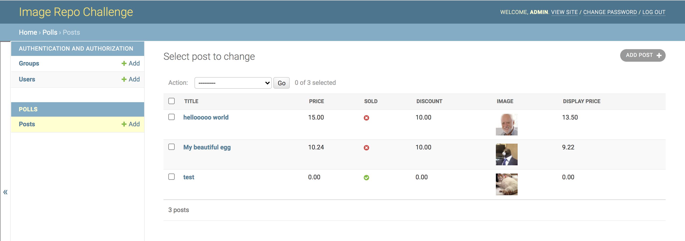

# iRepo
Django image repository for the Shopify backend challenge

## Manage Inventory of Images


The web interface allows admins to manage images and has a preview of existing images.

### Fields
Each image consists of five fields, price, total, sold, discount, cover. Additionally, a function to display the price after applying the discount is used in the admin page.

## Installation and Setup
Grab the repository
```
git clone https://github.com/EdwaRen/iRepo
cd iRepo
```
Install and migrate the database
```
pip install requirements.txt
python manage.py migrate
python manage.py runserver
```
Now visit localhost:8000/admin/polls/post/